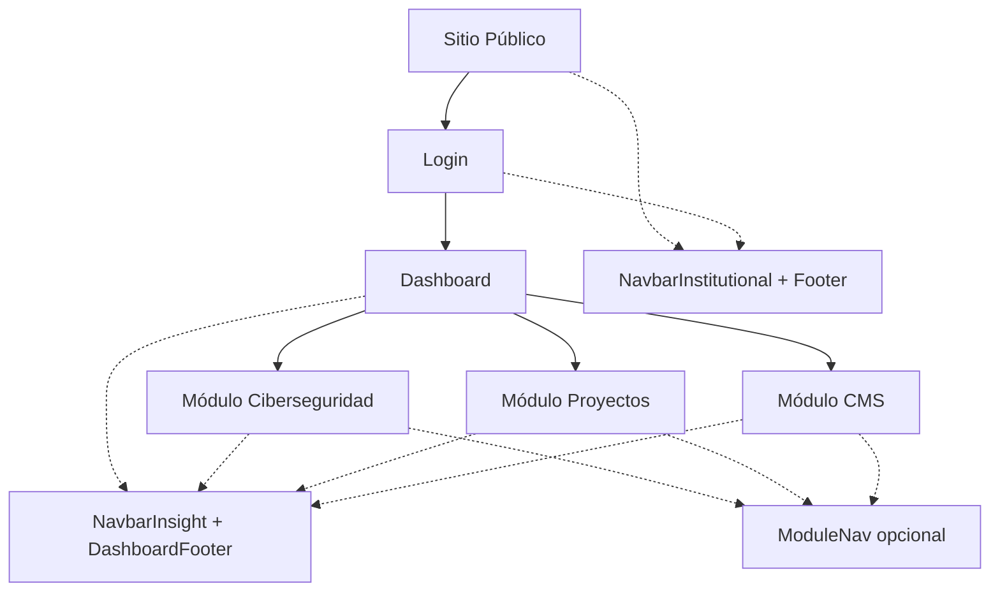

# Arquitectura de Navegación - UBO Insight MVP

## 📋 Resumen Ejecutivo

Se ha implementado una arquitectura de navegación limpia y organizada que separa claramente los contextos institucional y de UBO Insight, eliminando duplicados y proporcionando una experiencia de usuario consistente.

## 🏗️ Arquitectura Implementada

### **CONTEXTOS DE NAVEGACIÓN**

#### **1. CONTEXTO INSTITUCIONAL**
- **Uso:** Sitio público, páginas informativas, login
- **Navbar:** `NavbarInstitutionalComponent` (`app-navbar-institutional`)
- **Footer:** `FooterComponent` (`app-footer`)
- **Características:**
  - Logo UBO + título "UBO Insight"
  - Navegación a páginas públicas (Home, Servicios, Noticias, etc.)
  - Botón Mesa de Ayuda
  - Diseño institucional sobrio

#### **2. CONTEXTO UBO INSIGHT**
- **Uso:** Dashboard, módulos de ciberseguridad, proyectos, CMS
- **Navbar:** `NavbarInsightComponent` (`app-navbar-insight`)
- **Footer:** `DashboardFooterComponent` (`app-dashboard-footer`)
- **Características:**
  - Branding UBO Insight específico
  - Navegación entre módulos
  - Información de usuario logueado
  - Acciones específicas del dashboard

### **NAVEGACIÓN SECUNDARIA (OPCIONAL)**
- **Componente:** `ModuleNavComponent` (`app-module-nav`)
- **Uso:** Navegación interna dentro de módulos específicos
- **Características:**
  - Título del módulo con icono
  - Botón "Regresar a Dashboard"
  - Navegación entre secciones del módulo
  - Badges y estados (activo, deshabilitado)

## 📁 Estructura de Archivos

```
src/app/components/
├── navigation/
│   └── index.ts                    # Barrel de exportaciones
├── navbar/
│   ├── navbar.ts                   # NavbarInstitutionalComponent
│   └── navbar.html                 # Template institucional
├── shared/
│   ├── navbar-insight/             # NavbarInsightComponent (UBO Insight)
│   │   ├── navbar-insight.component.ts
│   │   ├── navbar-insight.component.html
│   │   └── navbar-insight.component.css
│   └── module-nav/                 # ModuleNavComponent (navegación secundaria)
│       ├── module-nav.component.ts
│       ├── module-nav.component.html
│       └── module-nav.component.scss
├── footer/
│   └── footer.ts                   # FooterComponent (institucional)
└── dashboard-footer/
    ├── dashboard-footer.component.ts    # Footer UBO Insight
    ├── dashboard-footer.component.html
    └── dashboard-footer.component.scss
```

## 🔄 Flujo de Navegación

### **SITIO PÚBLICO → LOGIN → DASHBOARD → MÓDULOS**



## ⚙️ Configuración Automática

### **APP.TS - LÓGICA DE CONTEXTO**
```typescript
ngOnInit(): void {
  this.router.events.pipe(
    filter(event => event instanceof NavigationEnd)
  ).subscribe((event: NavigationEnd) => {
    // Ocultar navbar/footer institucional en rutas de dashboard y módulos
    const hiddenRoutes = ['/login', '/dashboard', '/modules'];
    const shouldHide = hiddenRoutes.some(route => event.url.startsWith(route));
    this.showNavbarFooter.set(!shouldHide);
  });
}
```

### **COMPONENTES POR RUTA**
- **`/`, `/home`, `/servicios`, `/noticias`:** NavbarInstitutional + Footer
- **`/login`:** NavbarInstitutional (sin footer por diseño)
- **`/dashboard`, `/modules/*`:** NavbarInsight + DashboardFooter

## 🎨 Características de Diseño

### **NAVBAR INSTITUCIONAL**
- Logo UBO oficial
- Título "UBO Insight" + subtítulo "Analytics & Dashboard"
- Navegación horizontal en desktop
- Menú hamburguesa en móvil
- Botón Mesa de Ayuda naranja

### **NAVBAR UBO INSIGHT**
- Branding específico de UBO Insight
- Navegación entre módulos con permisos
- Información de usuario logueado
- Acciones contextuales (logout, perfil)

### **FOOTER DASHBOARD**
- Enlaces a módulos y recursos
- Información técnica (versión, entorno)
- Contacto y soporte
- Links a documentación y status del sistema

### **NAVEGACIÓN SECUNDARIA**
- Título del módulo con icono
- Botón minimalista "Regresar a Dashboard"
- Navegación horizontal con scroll
- Badges para notificaciones
- Estados activo/inactivo/deshabilitado

## 🔧 Uso e Implementación

### **IMPORTAR COMPONENTES**
```typescript
// Desde barrel de navegación
import { 
  NavbarInstitutionalComponent,
  NavbarInsightComponent,
  FooterComponent,
  DashboardFooterComponent 
} from './components/navigation';

// Navegación secundaria
import { ModuleNavComponent } from './components/shared/module-nav/module-nav.component';
```

### **USAR EN TEMPLATES**
```html
<!-- Contexto institucional -->
<app-navbar-institutional></app-navbar-institutional>
<main><!-- contenido --></main>
<app-footer></app-footer>

<!-- Contexto UBO Insight -->
<app-navbar-insight></app-navbar-insight>
<app-module-nav 
  moduleTitle="Ciberseguridad"
  moduleIcon="🛡️"
  [navItems]="navItems"
  [showBackButton]="true">
</app-module-nav>
<main><!-- contenido --></main>
<app-dashboard-footer></app-dashboard-footer>
```

### **CONFIGURAR NAVEGACIÓN SECUNDARIA**
```typescript
navItems: ModuleNavItem[] = [
  {
    id: 'overview',
    label: 'Resumen',
    route: '/modules/ciberseguridad/overview',
    icon: '📊'
  },
  {
    id: 'alerts',
    label: 'Alertas',
    route: '/modules/ciberseguridad/alerts',
    icon: '🚨',
    badge: '3'
  },
  {
    id: 'reports',
    label: 'Reportes',
    route: '/modules/ciberseguridad/reports',
    icon: '📋',
    disabled: true
  }
];
```

## 📊 Estado de Implementación

### **✅ COMPLETADO**
- [x] Navbar institucional para sitio público y login
- [x] Navbar UBO Insight para dashboard y módulos
- [x] Footer institucional
- [x] Footer UBO Insight (dashboard)
- [x] Navegación secundaria para módulos
- [x] Lógica automática de contexto en app.ts
- [x] Barrel de exportaciones organizadas
- [x] Limpieza de componentes duplicados

### **🎯 BENEFICIOS LOGRADOS**
- **Separación clara de contextos:** Institucional vs UBO Insight
- **Navegación consistente:** Misma experiencia en todos los módulos
- **Código limpio:** Sin duplicados, componentes organizados
- **Escalabilidad:** Fácil agregar nuevos módulos
- **Mantenibilidad:** Arquitectura clara y documentada

### **📈 MÉTRICAS**
- **Componentes de navegación:** 5 (organizados)
- **Contextos:** 2 (institucional + insight)
- **Rutas automáticas:** Configuración dinámica
- **Bundle size:** Optimizado sin duplicados

## 🚀 Próximos Pasos

1. **Implementar en módulos futuros:** Proyectos y CMS
2. **Breadcrumbs:** Navegación contextual avanzada
3. **Menú de usuario:** Perfil, configuración, logout
4. **Notificaciones:** Sistema de badges dinámicos
5. **Temas:** Soporte para modo oscuro

---

**La arquitectura de navegación está completamente implementada y lista para escalar con nuevos módulos y funcionalidades.** 🎯✨
