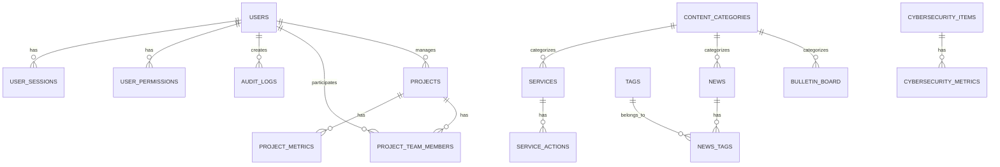

# UBO Insight MVP - Modelo de Base de Datos

## 📋 Información General

**SGBD Desarrollo:** PostgreSQL  
**SGBD Producción:** SQL Server (migración futura)  
**ORM:** Laravel Eloquent  
**Estrategia IDs:** UUIDs generados en aplicación  
**Compatibilidad:** Sintaxis SQL estándar para portabilidad  

---

## 🎯 Principios de Diseño

### 1. Portabilidad SQL Server
- **UUIDs:** Generados en aplicación con `Str::uuid()` de Laravel
- **Tipos de datos:** Compatibles entre PostgreSQL y SQL Server
- **Sintaxis:** Estándar SQL, evitar funciones específicas de PostgreSQL
- **Índices:** Estrategia compatible con ambos SGBD

### 2. Escalabilidad
- **Normalización:** 3FN para evitar redundancia
- **Índices:** Optimización de consultas frecuentes
- **Relaciones:** Foreign keys con cascadas apropiadas
- **Versionado:** Estructura preparada para evolución

### 3. Seguridad
- **Roles:** Sistema granular de permisos
- **Auditoría:** Timestamps automáticos
- **Integridad:** Constraints y validaciones
- **Encriptación:** Passwords hasheados con bcrypt

---

## 📊 Diagrama de Entidades



---

## 🗃️ Estructura de Tablas

### 1. Gestión de Usuarios y Autenticación

#### `users`
```sql
CREATE TABLE users (
    id UUID PRIMARY KEY DEFAULT gen_random_uuid(),
    email VARCHAR(255) UNIQUE NOT NULL,
    password_hash VARCHAR(255) NOT NULL,
    name VARCHAR(255) NOT NULL,
    role VARCHAR(50) NOT NULL CHECK (role IN ('admin', 'developer', 'project_manager', 'stakeholder')),
    avatar_url VARCHAR(500),
    is_active BOOLEAN DEFAULT true,
    email_verified_at TIMESTAMP,
    last_login_at TIMESTAMP,
    created_at TIMESTAMP DEFAULT CURRENT_TIMESTAMP,
    updated_at TIMESTAMP DEFAULT CURRENT_TIMESTAMP
);

-- Índices para optimización
CREATE INDEX idx_users_email ON users(email);
CREATE INDEX idx_users_role ON users(role);
CREATE INDEX idx_users_active ON users(is_active);
```

#### `user_permissions`
```sql
CREATE TABLE user_permissions (
    id UUID PRIMARY KEY DEFAULT gen_random_uuid(),
    user_id UUID NOT NULL REFERENCES users(id) ON DELETE CASCADE,
    permission VARCHAR(100) NOT NULL,
    granted_at TIMESTAMP DEFAULT CURRENT_TIMESTAMP,
    granted_by UUID REFERENCES users(id),
    created_at TIMESTAMP DEFAULT CURRENT_TIMESTAMP,
    
    UNIQUE(user_id, permission)
);

CREATE INDEX idx_user_permissions_user_id ON user_permissions(user_id);
CREATE INDEX idx_user_permissions_permission ON user_permissions(permission);
```

#### `user_sessions`
```sql
CREATE TABLE user_sessions (
    id UUID PRIMARY KEY DEFAULT gen_random_uuid(),
    user_id UUID NOT NULL REFERENCES users(id) ON DELETE CASCADE,
    token_hash VARCHAR(255) NOT NULL,
    ip_address INET,
    user_agent TEXT,
    expires_at TIMESTAMP NOT NULL,
    created_at TIMESTAMP DEFAULT CURRENT_TIMESTAMP
);

CREATE INDEX idx_user_sessions_user_id ON user_sessions(user_id);
CREATE INDEX idx_user_sessions_token ON user_sessions(token_hash);
CREATE INDEX idx_user_sessions_expires ON user_sessions(expires_at);
```

---

### 2. Gestión de Contenido

#### `content_categories`
```sql
CREATE TABLE content_categories (
    id UUID PRIMARY KEY DEFAULT gen_random_uuid(),
    name VARCHAR(100) NOT NULL,
    slug VARCHAR(100) UNIQUE NOT NULL,
    description TEXT,
    color_hex VARCHAR(7), -- Para categorización visual
    icon VARCHAR(50),
    is_active BOOLEAN DEFAULT true,
    created_at TIMESTAMP DEFAULT CURRENT_TIMESTAMP,
    updated_at TIMESTAMP DEFAULT CURRENT_TIMESTAMP
);

CREATE INDEX idx_content_categories_slug ON content_categories(slug);
CREATE INDEX idx_content_categories_active ON content_categories(is_active);
```

#### `services`
```sql
CREATE TABLE services (
    id UUID PRIMARY KEY DEFAULT gen_random_uuid(),
    title VARCHAR(255) NOT NULL,
    description TEXT NOT NULL,
    details TEXT,
    image_url VARCHAR(500),
    category_id UUID REFERENCES content_categories(id),
    display_order INTEGER DEFAULT 0,
    is_active BOOLEAN DEFAULT true,
    created_at TIMESTAMP DEFAULT CURRENT_TIMESTAMP,
    updated_at TIMESTAMP DEFAULT CURRENT_TIMESTAMP
);

CREATE INDEX idx_services_category ON services(category_id);
CREATE INDEX idx_services_active ON services(is_active);
CREATE INDEX idx_services_order ON services(display_order);
```

#### `service_actions`
```sql
CREATE TABLE service_actions (
    id UUID PRIMARY KEY DEFAULT gen_random_uuid(),
    service_id UUID NOT NULL REFERENCES services(id) ON DELETE CASCADE,
    button_text VARCHAR(100),
    action_type VARCHAR(50) NOT NULL CHECK (action_type IN ('login', 'mailto', 'redirect', 'none')),
    action_value VARCHAR(500), -- URL, email, etc.
    is_active BOOLEAN DEFAULT true,
    created_at TIMESTAMP DEFAULT CURRENT_TIMESTAMP,
    updated_at TIMESTAMP DEFAULT CURRENT_TIMESTAMP
);

CREATE INDEX idx_service_actions_service_id ON service_actions(service_id);
```

#### `news`
```sql
CREATE TABLE news (
    id UUID PRIMARY KEY DEFAULT gen_random_uuid(),
    title VARCHAR(255) NOT NULL,
    summary TEXT,
    content TEXT NOT NULL,
    image_url VARCHAR(500),
    category_id UUID REFERENCES content_categories(id),
    author VARCHAR(255),
    published_at TIMESTAMP,
    is_published BOOLEAN DEFAULT false,
    display_order INTEGER DEFAULT 0,
    created_at TIMESTAMP DEFAULT CURRENT_TIMESTAMP,
    updated_at TIMESTAMP DEFAULT CURRENT_TIMESTAMP
);

CREATE INDEX idx_news_category ON news(category_id);
CREATE INDEX idx_news_published ON news(is_published);
CREATE INDEX idx_news_published_at ON news(published_at);
CREATE INDEX idx_news_order ON news(display_order);
```

#### `tags`
```sql
CREATE TABLE tags (
    id UUID PRIMARY KEY DEFAULT gen_random_uuid(),
    name VARCHAR(100) UNIQUE NOT NULL,
    slug VARCHAR(100) UNIQUE NOT NULL,
    color_hex VARCHAR(7),
    created_at TIMESTAMP DEFAULT CURRENT_TIMESTAMP
);

CREATE INDEX idx_tags_slug ON tags(slug);
```

#### `news_tags`
```sql
CREATE TABLE news_tags (
    id UUID PRIMARY KEY DEFAULT gen_random_uuid(),
    news_id UUID NOT NULL REFERENCES news(id) ON DELETE CASCADE,
    tag_id UUID NOT NULL REFERENCES tags(id) ON DELETE CASCADE,
    created_at TIMESTAMP DEFAULT CURRENT_TIMESTAMP,
    
    UNIQUE(news_id, tag_id)
);

CREATE INDEX idx_news_tags_news_id ON news_tags(news_id);
CREATE INDEX idx_news_tags_tag_id ON news_tags(tag_id);
```

#### `bulletin_board`
```sql
CREATE TABLE bulletin_board (
    id UUID PRIMARY KEY DEFAULT gen_random_uuid(),
    title VARCHAR(255) NOT NULL,
    content TEXT NOT NULL,
    type VARCHAR(50) NOT NULL CHECK (type IN ('importante', 'mantencion', 'evento', 'politica')),
    category_id UUID REFERENCES content_categories(id),
    published_at TIMESTAMP DEFAULT CURRENT_TIMESTAMP,
    valid_until TIMESTAMP,
    is_active BOOLEAN DEFAULT true,
    display_order INTEGER DEFAULT 0,
    created_at TIMESTAMP DEFAULT CURRENT_TIMESTAMP,
    updated_at TIMESTAMP DEFAULT CURRENT_TIMESTAMP
);

CREATE INDEX idx_bulletin_board_type ON bulletin_board(type);
CREATE INDEX idx_bulletin_board_active ON bulletin_board(is_active);
CREATE INDEX idx_bulletin_board_valid_until ON bulletin_board(valid_until);
CREATE INDEX idx_bulletin_board_order ON bulletin_board(display_order);
```

---

### 3. Módulo de Ciberseguridad

#### `cybersecurity_items`
```sql
CREATE TABLE cybersecurity_items (
    id UUID PRIMARY KEY DEFAULT gen_random_uuid(),
    title VARCHAR(255) NOT NULL,
    description TEXT NOT NULL,
    details TEXT,
    image_url VARCHAR(500),
    item_type VARCHAR(100), -- 'policy', 'training', 'incident', 'audit', 'identity'
    display_order INTEGER DEFAULT 0,
    is_active BOOLEAN DEFAULT true,
    created_at TIMESTAMP DEFAULT CURRENT_TIMESTAMP,
    updated_at TIMESTAMP DEFAULT CURRENT_TIMESTAMP
);

CREATE INDEX idx_cybersecurity_items_type ON cybersecurity_items(item_type);
CREATE INDEX idx_cybersecurity_items_active ON cybersecurity_items(is_active);
CREATE INDEX idx_cybersecurity_items_order ON cybersecurity_items(display_order);
```

#### `cybersecurity_metrics`
```sql
CREATE TABLE cybersecurity_metrics (
    id UUID PRIMARY KEY DEFAULT gen_random_uuid(),
    metric_name VARCHAR(100) NOT NULL,
    metric_value DECIMAL(10,2) NOT NULL,
    metric_unit VARCHAR(50), -- 'count', 'percentage', 'days', etc.
    period_start DATE NOT NULL,
    period_end DATE NOT NULL,
    category VARCHAR(100), -- 'incidents', 'audits', 'training', etc.
    description TEXT,
    created_at TIMESTAMP DEFAULT CURRENT_TIMESTAMP,
    updated_at TIMESTAMP DEFAULT CURRENT_TIMESTAMP
);

CREATE INDEX idx_cybersecurity_metrics_name ON cybersecurity_metrics(metric_name);
CREATE INDEX idx_cybersecurity_metrics_period ON cybersecurity_metrics(period_start, period_end);
CREATE INDEX idx_cybersecurity_metrics_category ON cybersecurity_metrics(category);
```

---

### 4. Módulo de Proyectos

#### `projects`
```sql
CREATE TABLE projects (
    id UUID PRIMARY KEY DEFAULT gen_random_uuid(),
    name VARCHAR(255) NOT NULL,
    description TEXT,
    status VARCHAR(50) NOT NULL CHECK (status IN ('planning', 'in-progress', 'on-hold', 'completed', 'cancelled')),
    priority VARCHAR(20) NOT NULL CHECK (priority IN ('low', 'medium', 'high', 'critical')),
    budget DECIMAL(12,2),
    spent DECIMAL(12,2) DEFAULT 0,
    progress_percentage INTEGER DEFAULT 0 CHECK (progress_percentage >= 0 AND progress_percentage <= 100),
    start_date DATE,
    end_date DATE,
    manager_id UUID REFERENCES users(id),
    created_at TIMESTAMP DEFAULT CURRENT_TIMESTAMP,
    updated_at TIMESTAMP DEFAULT CURRENT_TIMESTAMP
);

CREATE INDEX idx_projects_status ON projects(status);
CREATE INDEX idx_projects_priority ON projects(priority);
CREATE INDEX idx_projects_manager ON projects(manager_id);
CREATE INDEX idx_projects_dates ON projects(start_date, end_date);
```

#### `project_team_members`
```sql
CREATE TABLE project_team_members (
    id UUID PRIMARY KEY DEFAULT gen_random_uuid(),
    project_id UUID NOT NULL REFERENCES projects(id) ON DELETE CASCADE,
    user_id UUID NOT NULL REFERENCES users(id) ON DELETE CASCADE,
    role VARCHAR(100), -- 'developer', 'analyst', 'designer', etc.
    joined_at TIMESTAMP DEFAULT CURRENT_TIMESTAMP,
    left_at TIMESTAMP,
    is_active BOOLEAN DEFAULT true,
    created_at TIMESTAMP DEFAULT CURRENT_TIMESTAMP,
    
    UNIQUE(project_id, user_id)
);

CREATE INDEX idx_project_team_project_id ON project_team_members(project_id);
CREATE INDEX idx_project_team_user_id ON project_team_members(user_id);
CREATE INDEX idx_project_team_active ON project_team_members(is_active);
```

#### `project_metrics`
```sql
CREATE TABLE project_metrics (
    id UUID PRIMARY KEY DEFAULT gen_random_uuid(),
    project_id UUID REFERENCES projects(id) ON DELETE CASCADE,
    metric_name VARCHAR(100) NOT NULL,
    metric_value DECIMAL(10,2) NOT NULL,
    metric_unit VARCHAR(50),
    recorded_at TIMESTAMP DEFAULT CURRENT_TIMESTAMP,
    period_start DATE,
    period_end DATE,
    notes TEXT,
    created_at TIMESTAMP DEFAULT CURRENT_TIMESTAMP
);

CREATE INDEX idx_project_metrics_project_id ON project_metrics(project_id);
CREATE INDEX idx_project_metrics_name ON project_metrics(metric_name);
CREATE INDEX idx_project_metrics_recorded ON project_metrics(recorded_at);
```

---

### 5. Sistema de Auditoría

#### `audit_logs`
```sql
CREATE TABLE audit_logs (
    id UUID PRIMARY KEY DEFAULT gen_random_uuid(),
    user_id UUID REFERENCES users(id),
    action VARCHAR(100) NOT NULL, -- 'create', 'update', 'delete', 'login', etc.
    table_name VARCHAR(100),
    record_id UUID,
    old_values JSONB,
    new_values JSONB,
    ip_address INET,
    user_agent TEXT,
    created_at TIMESTAMP DEFAULT CURRENT_TIMESTAMP
);

CREATE INDEX idx_audit_logs_user_id ON audit_logs(user_id);
CREATE INDEX idx_audit_logs_action ON audit_logs(action);
CREATE INDEX idx_audit_logs_table ON audit_logs(table_name);
CREATE INDEX idx_audit_logs_created_at ON audit_logs(created_at);
```

---

### 6. Configuración del Sistema

#### `system_settings`
```sql
CREATE TABLE system_settings (
    id UUID PRIMARY KEY DEFAULT gen_random_uuid(),
    key VARCHAR(100) UNIQUE NOT NULL,
    value TEXT,
    description TEXT,
    type VARCHAR(50) DEFAULT 'string', -- 'string', 'number', 'boolean', 'json'
    is_public BOOLEAN DEFAULT false, -- Si puede ser accedido desde frontend
    updated_by UUID REFERENCES users(id),
    created_at TIMESTAMP DEFAULT CURRENT_TIMESTAMP,
    updated_at TIMESTAMP DEFAULT CURRENT_TIMESTAMP
);

CREATE INDEX idx_system_settings_key ON system_settings(key);
CREATE INDEX idx_system_settings_public ON system_settings(is_public);
```

---

## 🔄 Migración desde JSON

### Estrategia de Migración

#### 1. Seeders de Laravel
```php
// database/seeders/ContentSeeder.php
class ContentSeeder extends Seeder
{
    public function run()
    {
        // Migrar servicios.json → services + service_actions
        $serviciosJson = json_decode(file_get_contents(storage_path('app/json/servicios.json')), true);
        
        foreach ($serviciosJson as $servicio) {
            $service = Service::create([
                'id' => Str::uuid(),
                'title' => $servicio['title'],
                'description' => $servicio['description'],
                'details' => $servicio['details'],
                'image_url' => $servicio['image'],
                'display_order' => $servicio['id']
            ]);
            
            if ($servicio['hasButton']) {
                ServiceAction::create([
                    'service_id' => $service->id,
                    'button_text' => $servicio['buttonText'],
                    'action_type' => $this->parseActionType($servicio['buttonAction']),
                    'action_value' => $servicio['buttonAction']
                ]);
            }
        }
    }
}
```

#### 2. Comandos Artisan para Migración
```php
// app/Console/Commands/MigrateJsonToDatabase.php
class MigrateJsonToDatabase extends Command
{
    protected $signature = 'migrate:json-to-db {--table=all}';
    
    public function handle()
    {
        $this->info('Iniciando migración de JSON a Base de Datos...');
        
        $this->migrateServices();
        $this->migrateNews();
        $this->migrateUsers();
        $this->migrateBulletinBoard();
        $this->migrateCybersecurity();
        $this->migrateProjects();
        
        $this->info('Migración completada exitosamente.');
    }
}
```

---

## 🚀 Queries de Ejemplo

### Consultas Frecuentes

#### 1. Servicios Activos con Acciones
```sql
SELECT 
    s.id,
    s.title,
    s.description,
    s.image_url,
    sa.button_text,
    sa.action_type,
    sa.action_value
FROM services s
LEFT JOIN service_actions sa ON s.id = sa.service_id AND sa.is_active = true
WHERE s.is_active = true
ORDER BY s.display_order;
```

#### 2. Noticias con Categorías y Tags
```sql
SELECT 
    n.id,
    n.title,
    n.summary,
    n.published_at,
    cc.name as category_name,
    STRING_AGG(t.name, ', ') as tags
FROM news n
LEFT JOIN content_categories cc ON n.category_id = cc.id
LEFT JOIN news_tags nt ON n.id = nt.news_id
LEFT JOIN tags t ON nt.tag_id = t.id
WHERE n.is_published = true
GROUP BY n.id, n.title, n.summary, n.published_at, cc.name
ORDER BY n.published_at DESC;
```

#### 3. Dashboard de Proyectos
```sql
SELECT 
    p.id,
    p.name,
    p.status,
    p.progress_percentage,
    p.budget,
    p.spent,
    u.name as manager_name,
    COUNT(ptm.user_id) as team_size
FROM projects p
LEFT JOIN users u ON p.manager_id = u.id
LEFT JOIN project_team_members ptm ON p.id = ptm.project_id AND ptm.is_active = true
GROUP BY p.id, p.name, p.status, p.progress_percentage, p.budget, p.spent, u.name
ORDER BY p.created_at DESC;
```

#### 4. Métricas de Ciberseguridad
```sql
SELECT 
    metric_name,
    metric_value,
    metric_unit,
    period_start,
    period_end,
    category
FROM cybersecurity_metrics
WHERE period_end >= CURRENT_DATE - INTERVAL '30 days'
ORDER BY period_end DESC, category, metric_name;
```

---

## 🔧 Configuración Laravel

### Models con Relaciones

#### User Model
```php
class User extends Authenticatable
{
    protected $fillable = ['email', 'name', 'role', 'avatar_url'];
    protected $hidden = ['password_hash'];
    protected $casts = [
        'is_active' => 'boolean',
        'email_verified_at' => 'datetime',
        'last_login_at' => 'datetime',
    ];
    
    public function permissions()
    {
        return $this->hasMany(UserPermission::class);
    }
    
    public function managedProjects()
    {
        return $this->hasMany(Project::class, 'manager_id');
    }
    
    public function projectMemberships()
    {
        return $this->hasMany(ProjectTeamMember::class);
    }
}
```

#### Service Model
```php
class Service extends Model
{
    protected $fillable = ['title', 'description', 'details', 'image_url', 'category_id', 'display_order'];
    protected $casts = ['is_active' => 'boolean'];
    
    public function category()
    {
        return $this->belongsTo(ContentCategory::class, 'category_id');
    }
    
    public function actions()
    {
        return $this->hasMany(ServiceAction::class);
    }
    
    public function activeAction()
    {
        return $this->hasOne(ServiceAction::class)->where('is_active', true);
    }
}
```

---

## 📈 Optimización y Performance

### Índices Estratégicos
1. **Búsquedas frecuentes:** email, slug, status
2. **Filtros comunes:** is_active, published_at, category_id
3. **Ordenamiento:** display_order, created_at, published_at
4. **Relaciones:** Foreign keys con índices

### Caching Strategy
```php
// Cache de servicios activos
Cache::remember('services.active', 3600, function () {
    return Service::with(['category', 'activeAction'])
        ->where('is_active', true)
        ->orderBy('display_order')
        ->get();
});

// Cache de noticias recientes
Cache::remember('news.recent', 1800, function () {
    return News::with(['category', 'tags'])
        ->where('is_published', true)
        ->orderBy('published_at', 'desc')
        ->limit(10)
        ->get();
});
```

---

## 🔒 Seguridad y Validaciones

### Constraints de Integridad
- **Foreign Keys:** Con cascadas apropiadas
- **Check Constraints:** Para valores enum
- **Unique Constraints:** Para prevenir duplicados
- **Not Null:** Para campos obligatorios

### Validaciones Laravel
```php
// Validación de servicios
$request->validate([
    'title' => 'required|string|max:255',
    'description' => 'required|string',
    'image_url' => 'nullable|url|max:500',
    'category_id' => 'nullable|uuid|exists:content_categories,id'
]);

// Validación de usuarios
$request->validate([
    'email' => 'required|email|unique:users,email',
    'role' => 'required|in:admin,developer,project_manager,stakeholder',
    'permissions.*' => 'string|in:ciberseguridad,proyectos,cms,datos'
]);
```

---

## 🔄 Próximos Pasos

### Fase 1: Implementación Base
1. **Migraciones:** Crear todas las tablas con Laravel migrations
2. **Models:** Implementar modelos con relaciones
3. **Seeders:** Migrar datos JSON existentes
4. **APIs:** Crear endpoints REST básicos

### Fase 2: Funcionalidades Avanzadas
1. **Autenticación:** Sistema completo con JWT/Sanctum
2. **Permisos:** Middleware de autorización
3. **CMS:** Interface de administración
4. **Analytics:** Dashboard con métricas

### Fase 3: Optimización
1. **Performance:** Query optimization, caching
2. **Testing:** Unit tests, feature tests
3. **Documentation:** API documentation
4. **Monitoring:** Logs, metrics, alerts

---

**Última actualización:** Diciembre 2024  
**Estado:** Diseño completo - Listo para implementación  
**Próximo paso:** Crear migraciones Laravel
