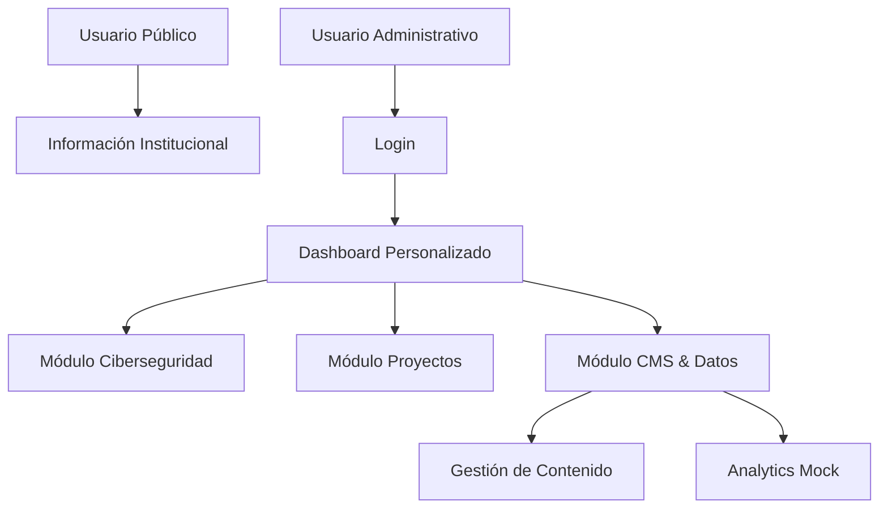
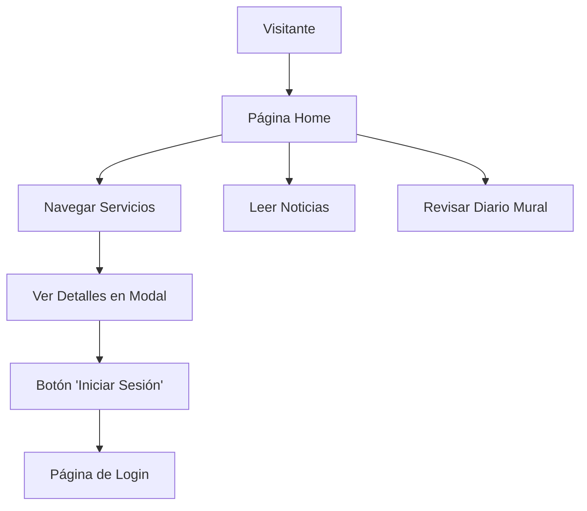
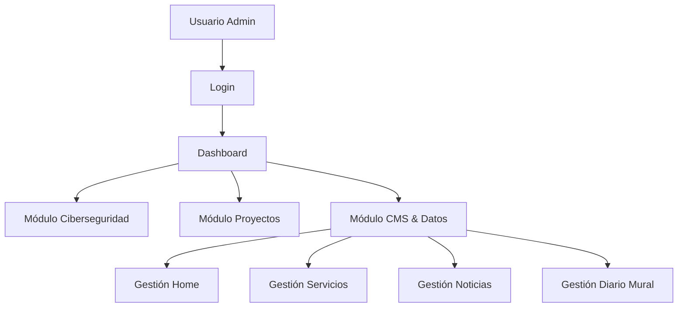

# UBO Insight MVP - Documentación Técnica y Pedagógica

## 📚 Índice

1. [Introducción](#introducción)
2. [Lógica del Producto](#lógica-del-producto)
3. [Arquitectura del Sistema](#arquitectura-del-sistema)
4. [Etapas de Desarrollo](#etapas-de-desarrollo)
5. [Componentes del Sistema](#componentes-del-sistema)
6. [Implementación Técnica](#implementación-técnica)
7. [Guía de Reproducción](#guía-de-reproducción)
8. [Flujos de Usuario](#flujos-de-usuario)
9. [Estructura de Datos](#estructura-de-datos)
10. [Consideraciones Pedagógicas](#consideraciones-pedagógicas)

---

## 🎯 Introducción

**UBO Insight MVP** es una plataforma integral de análisis y gestión de contenido desarrollada como un **Minimum Viable Product (MVP)** que demuestra conceptos avanzados de desarrollo web moderno. El proyecto combina un sitio web público informativo con un sistema administrativo completo, implementando patrones de arquitectura empresarial y mejores prácticas de desarrollo.

### Objetivos Pedagógicos

- **Demostrar arquitectura modular** en aplicaciones web modernas
- **Implementar autenticación y autorización** basada en roles
- **Separar responsabilidades** entre contenido público y administrativo
- **Aplicar patrones de diseño** como SPA, Component-Based Architecture
- **Utilizar tecnologías actuales** (Angular 20, Signals, Zoneless Change Detection)

---

## 🧠 Lógica del Producto

### Concepto Central

UBO Insight MVP simula una **plataforma institucional** que:

1. **Presenta información pública** (servicios, noticias, avisos)
2. **Proporciona herramientas analíticas** para diferentes roles organizacionales
3. **Permite gestión de contenido** a través de un CMS integrado
4. **Ofrece dashboards especializados** según el perfil del usuario

### Propuesta de Valor



### Casos de Uso Principales

1. **Visitante Público**: Consulta servicios, lee noticias, revisa avisos
2. **Administrador**: Gestiona todo el contenido y accede a todos los módulos
3. **Desarrollador**: Accede a módulos técnicos (Ciberseguridad, Proyectos)
4. **Project Manager**: Gestiona proyectos y contenido CMS
5. **Stakeholder**: Visualiza dashboards en modo solo lectura

---

## 🏗️ Arquitectura del Sistema

### Stack Tecnológico

**Frontend:**
- **Angular 20** - Framework principal
- **Tailwind CSS 3.4** - Framework de estilos
- **Angular Signals** - Gestión de estado reactivo
- **Zoneless Change Detection** - Optimización de rendimiento

**Backend (Preparado):**
- **Laravel 11** - API RESTful
- **PostgreSQL** - Base de datos (con soporte UUID)

**Infraestructura:**
- **Nginx** - Servidor web y proxy reverso
- **PHP-FPM** - Procesamiento PHP

### Patrones Arquitectónicos

1. **Single Page Application (SPA)**
2. **Component-Based Architecture**
3. **Module Federation**
4. **Role-Based Access Control (RBAC)**
5. **Separation of Concerns**

### Estructura de Directorios

```
ubo-insight-mvp/
├── frontend/                    # Aplicación Angular
│   ├── src/
│   │   ├── app/
│   │   │   ├── components/      # Componentes públicos
│   │   │   ├── modules/         # Módulos administrativos
│   │   │   ├── services/        # Servicios de negocio
│   │   │   └── shared/          # Componentes reutilizables
│   │   └── assets/
│   │       └── data/            # Datos mock JSON
│   └── ...
├── backend/                     # API Laravel (estructura base)
└── docs/                        # Documentación adicional
```

---

## 📈 Etapas de Desarrollo

### Fase 1: Fundación (Completada)
- ✅ Configuración del proyecto Angular
- ✅ Implementación de componentes públicos
- ✅ Diseño responsive con Tailwind CSS
- ✅ Datos mock en formato JSON

### Fase 2: Autenticación y Autorización (Completada)
- ✅ Sistema de login con usuarios mock
- ✅ Implementación de roles y permisos
- ✅ Gestión de sesiones con localStorage
- ✅ Guards de ruta para protección

### Fase 3: Módulos Administrativos (Completada)
- ✅ Dashboard post-login personalizado
- ✅ Módulo Ciberseguridad con métricas de seguridad
- ✅ Módulo Proyectos con gestión de proyectos
- ✅ Módulo CMS & Datos para administración

### Fase 4: Sistema CMS Completo (Completada)
- ✅ Gestión de contenido del Home
- ✅ Administración de Servicios
- ✅ Gestión de Noticias
- ✅ Administración del Diario Mural

### Fase 5: Optimizaciones Técnicas (Completada)
- ✅ Migración a Zoneless Change Detection
- ✅ Implementación de Angular Signals
- ✅ Separación de datos CMS vs Analytics
- ✅ Navegación modular completa

### Fase 6: Integración Backend (Pendiente)
- ⏳ Conexión con API Laravel
- ⏳ Autenticación real con JWT
- ⏳ Persistencia de datos en PostgreSQL
- ⏳ Implementación de endpoints RESTful

---

## 🧩 Componentes del Sistema

### Componentes Públicos

#### 1. HomeComponent
**Propósito**: Página principal con slider hero y métricas institucionales
**Características**:
- Slider automático de 3 slides
- Sección de métricas dinámicas
- Navegación responsive

#### 2. ServiciosComponent
**Propósito**: Catálogo de servicios institucionales
**Características**:
- Grid responsivo de servicios
- Modal con carrusel de detalles
- Botones de acción configurables

#### 3. NoticiasComponent
**Propósito**: Portal de noticias y artículos
**Características**:
- Lista de noticias categorizadas
- Sistema de noticias destacadas
- Filtrado por categorías

#### 4. DiarioMuralComponent
**Propósito**: Avisos y comunicados oficiales
**Características**:
- Avisos categorizados por tipo
- Sistema de prioridades
- Fechas de expiración

### Componentes Administrativos

#### 1. LoginComponent
**Propósito**: Autenticación de usuarios administrativos
**Características**:
- Validación de credenciales
- Manejo de errores
- Redirección post-login

#### 2. DashboardComponent
**Propósito**: Hub central post-login
**Características**:
- Módulos filtrados por permisos
- Información del usuario actual
- Navegación a módulos especializados

#### 3. Módulos Especializados

**CiberseguridadDashboardComponent**:
- Métricas de seguridad
- Alertas de seguridad
- Gráficos de tendencias

**ProyectosDashboardComponent**:
- Métricas de proyectos
- Lista de proyectos activos
- Indicadores de progreso

**CMSDashboardComponent**:
- Panel de administración de contenido
- Acceso a sub-módulos CMS
- Estadísticas de contenido

### Componentes CMS

#### 1. HomeContentComponent
**Propósito**: Gestión de slides y métricas del home
**Características**:
- Editor de slides con vista previa
- Gestión de métricas institucionales
- Funciones CRUD completas

#### 2. ServicesContentComponent
**Propósito**: Administración de servicios
**Características**:
- Lista y edición de servicios
- Configuración de botones de acción
- Gestión de categorías

#### 3. NewsContentComponent
**Propósito**: Gestión de noticias
**Características**:
- Editor de noticias completo
- Sistema de categorías
- Gestión de noticias destacadas

#### 4. DiarioMuralContentComponent
**Propósito**: Administración de avisos
**Características**:
- Gestión de avisos por tipo
- Sistema de prioridades
- Control de fechas de expiración

### Componentes Compartidos

#### 1. CardComponent
**Propósito**: Componente reutilizable para mostrar información
**Props**: `item`, `showButton`
**Events**: `cardClick`, `buttonClick`

#### 2. GridComponent
**Propósito**: Layout responsivo para colecciones de cards
**Props**: `items`, `columns`
**Features**: Grid responsivo automático

#### 3. ModalCarouselComponent
**Propósito**: Modal con navegación tipo carrusel
**Features**: Navegación entre items, cierre con escape

---

## ⚙️ Implementación Técnica

### Gestión de Estado con Signals

```typescript
// Ejemplo de implementación con Signals
export class HomeContentComponent {
  slides = signal<Slide[]>([]);
  metrics = signal<Metric[]>([]);
  isLoading = signal(true);

  ngOnInit(): void {
    this.loadData();
  }

  addSlide(): void {
    this.slides.update(slides => [...slides, newSlide]);
  }
}
```

### Autenticación y Autorización

```typescript
// AuthService con Signals
export class AuthService {
  private currentUserSubject = new BehaviorSubject<User | null>(null);
  currentUser = signal<User | null>(null);

  login(credentials: LoginCredentials): Observable<boolean> {
    return this.http.get<User[]>('/assets/data/usuarios.json').pipe(
      map(users => {
        const user = users.find(u => 
          u.email === credentials.email && 
          u.password === credentials.password
        );
        if (user) {
          this.setCurrentUser(user);
          return true;
        }
        return false;
      })
    );
  }
}
```

### Zoneless Change Detection

```typescript
// app.config.ts
export const appConfig: ApplicationConfig = {
  providers: [
    provideZoneChangeDetection({ eventCoalescing: true }),
    provideRouter(routes),
    provideHttpClient(),
    // ... otros providers
  ]
};
```

### Routing Modular

```typescript
// Estructura de rutas
export const routes: Routes = [
  // Rutas públicas
  { path: 'home', component: HomeComponent },
  { path: 'servicios', component: ServiciosComponent },
  
  // Autenticación
  { path: 'login', component: LoginComponent },
  
  // Dashboard administrativo
  { path: 'dashboard', component: DashboardComponent },
  
  // Módulos especializados
  { path: 'modules/ciberseguridad', component: CiberseguridadDashboardComponent },
  { path: 'modules/proyectos', component: ProyectosDashboardComponent },
  { path: 'modules/cms', component: CMSDashboardComponent },
  
  // Sub-rutas CMS
  { path: 'modules/cms/home', component: HomeContentComponent },
  { path: 'modules/cms/services', component: ServicesContentComponent },
  // ...
];
```

---

## 🚀 Guía de Reproducción

### Prerrequisitos

- **Node.js** 18+ 
- **npm** 9+
- **Angular CLI** 20+
- **Git**

### Instalación Paso a Paso

1. **Clonar el repositorio**
```bash
git clone <repository-url>
cd ubo-insight-mvp
```

2. **Instalar dependencias del frontend**
```bash
cd frontend
npm install
```

3. **Ejecutar en modo desarrollo**
```bash
ng serve
```

4. **Acceder a la aplicación**
- URL: `http://localhost:4200`
- Credenciales de prueba disponibles en `usuarios.json`

### Estructura de Archivos Clave

```
frontend/src/
├── app/
│   ├── app.config.ts           # Configuración principal
│   ├── app.routes.ts           # Definición de rutas
│   ├── components/             # Componentes públicos
│   ├── modules/                # Módulos administrativos
│   ├── services/               # Servicios de negocio
│   └── shared/                 # Componentes reutilizables
├── assets/
│   └── data/                   # Datos mock JSON
└── main.ts                     # Punto de entrada
```

### Comandos de Desarrollo

```bash
# Desarrollo
ng serve                        # Servidor de desarrollo
ng build                        # Build de producción
ng test                         # Ejecutar tests
ng lint                         # Linting del código

# Generación de componentes
ng generate component nombre    # Nuevo componente
ng generate service nombre      # Nuevo servicio
ng generate module nombre       # Nuevo módulo
```

---

## 👤 Flujos de Usuario

### Flujo Público



### Flujo Administrativo



### Matriz de Permisos

| Rol | Ciberseguridad | Proyectos | CMS | Datos |
|-----|----------------|-----------|-----|-------|
| Admin | ✅ | ✅ | ✅ | ✅ |
| Developer | ✅ | ✅ | ❌ | ✅ |
| Project Manager | ❌ | ✅ | ✅ | ❌ |
| Stakeholder | 👁️ | 👁️ | ❌ | ❌ |

*✅ = Acceso completo, 👁️ = Solo lectura, ❌ = Sin acceso*

---

## 📊 Estructura de Datos

### Usuarios (usuarios.json)

```json
{
  "id": 1,
  "name": "Administrador",
  "email": "uboinsight@ubo.cl",
  "password": "admin123",
  "role": "admin",
  "permissions": ["ciberseguridad", "proyectos", "cms", "datos"]
}
```

### Servicios (servicios.json)

```json
{
  "id": 1,
  "title": "Título del Servicio",
  "description": "Descripción del servicio",
  "image": "/path/to/image.jpg",
  "category": "Categoría",
  "button": {
    "text": "Texto del botón",
    "action": "login|modal|redirect",
    "route": "/ruta/opcional"
  }
}
```

### Noticias (noticias.json)

```json
{
  "id": 1,
  "title": "Título de la noticia",
  "summary": "Resumen breve",
  "content": "Contenido completo...",
  "image": "/path/to/image.jpg",
  "category": "Categoría",
  "date": "2024-01-01",
  "author": "Autor",
  "featured": true
}
```

### Mock Analytics

**Ciberseguridad (ciberseguridad-data.json)**:
- Métricas de seguridad
- Alertas activas
- Datos de gráficos

**Proyectos (proyectos-data.json)**:
- Métricas de proyectos
- Lista de proyectos
- Indicadores de progreso

---

## 🎓 Consideraciones Pedagógicas

### Conceptos Demostrados

1. **Arquitectura Modular**
   - Separación clara de responsabilidades
   - Componentes reutilizables
   - Módulos especializados

2. **Gestión de Estado Moderna**
   - Angular Signals para reactividad
   - Zoneless Change Detection
   - Optimización de rendimiento

3. **Seguridad y Autorización**
   - Autenticación basada en roles
   - Guards de ruta
   - Separación de contextos público/privado

4. **Experiencia de Usuario**
   - Diseño responsive
   - Estados de carga
   - Navegación intuitiva

5. **Escalabilidad**
   - Estructura preparada para backend
   - Separación de datos
   - Patrones empresariales

### Ejercicios Sugeridos

1. **Agregar nuevo módulo** con dashboard personalizado
2. **Implementar nuevos roles** con permisos específicos
3. **Crear componentes CMS adicionales** para otros tipos de contenido
4. **Integrar gráficos reales** con librerías como Chart.js
5. **Conectar con API backend** real

### Extensiones Posibles

- **Internacionalización (i18n)** para múltiples idiomas
- **Progressive Web App (PWA)** para funcionalidad offline
- **Server-Side Rendering (SSR)** para mejor SEO
- **Testing automatizado** con Jest y Cypress
- **CI/CD pipeline** con GitHub Actions

---

## 📝 Conclusión

UBO Insight MVP representa una implementación completa de una aplicación web moderna que combina conceptos teóricos con aplicación práctica. El proyecto demuestra cómo estructurar una aplicación escalable, implementar patrones de diseño apropiados, y crear una experiencia de usuario coherente.

La separación clara entre el sitio público y el sistema administrativo, junto con la implementación de roles y permisos, proporciona una base sólida para entender cómo funcionan las aplicaciones empresariales en el mundo real.

**Próximos pasos recomendados**:
1. Integración con backend Laravel
2. Implementación de tests automatizados
3. Optimizaciones de rendimiento adicionales
4. Despliegue en entorno de producción

---

*Para términos técnicos y definiciones, consultar el [Glosario](./glosario.md)*
