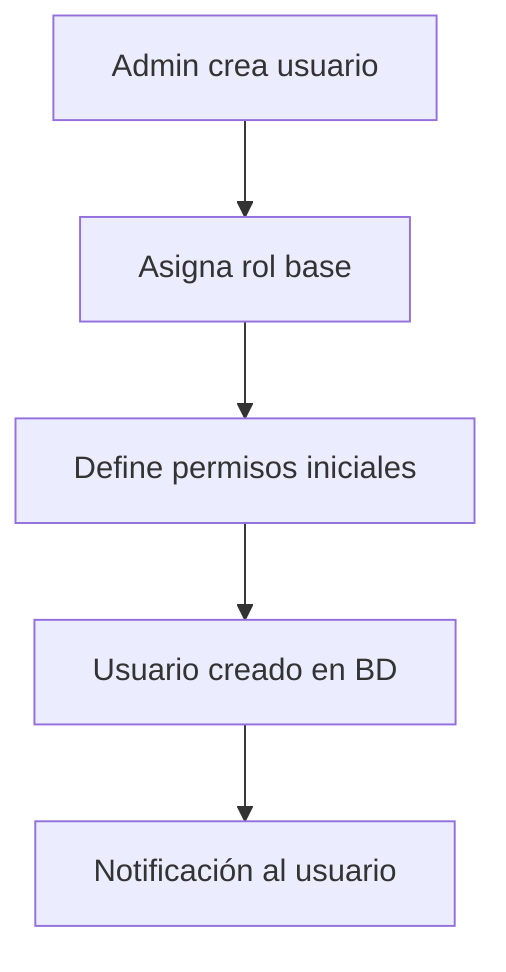
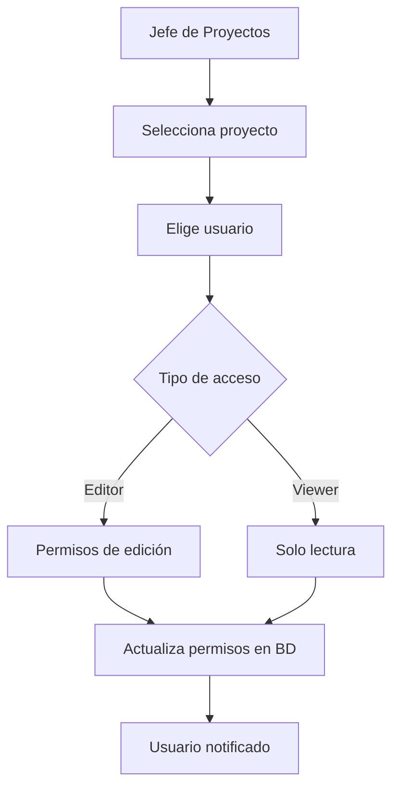
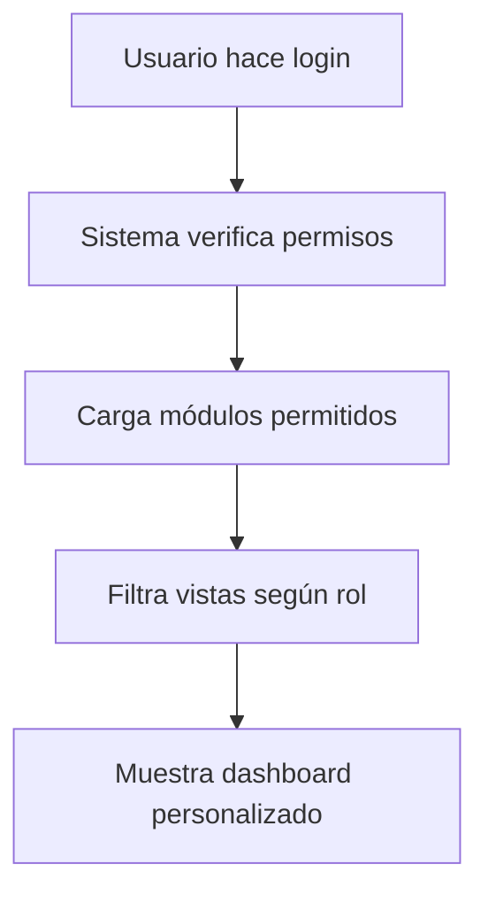

# UBO Insight MVP - Sistema de Privilegios y Roles de Usuario

## 📋 Información General

**Objetivo:** Definir claramente los privilegios, roles y permisos de cada tipo de usuario en la plataforma UBO Insight MVP.

**Principios:**
- Solo el **Admin** puede determinar roles de nuevos usuarios
- El **Jefe de Proyectos** gestiona proyectos y asigna permisos de colaboración
- Los **usuarios** acceden según sus permisos asignados
- Los datos de usuarios se consumen desde **PostgreSQL** (no mock)

---

## 🎭 Roles y Definiciones

### 1. Administrador (admin)
**Descripción:** Control total del sistema y gestión de usuarios.

**Privilegios:**
- ✅ **Gestión de Usuarios**: Crear, editar, eliminar usuarios y asignar roles
- ✅ **Acceso Total**: Todos los módulos y funcionalidades
- ✅ **Configuración del Sistema**: Ajustes globales y parámetros
- ✅ **Gestión de Proyectos**: Crear, editar, eliminar proyectos
- ✅ **Asignación de Roles**: Determinar el rol de nuevos usuarios
- ✅ **Supervisión**: Monitoreo de actividades y auditoría

**Módulos Accesibles:**
- 🛡️ Ciberseguridad (Completo)
- 📊 Proyectos (Completo)
- ⚙️ CMS & Datos (Completo)
- 📈 Dashboards Ejecutivos (Completo)
- 👥 Gestión de Usuarios (Completo)

**Permisos en BD:**
```json
["ciberseguridad", "proyectos", "cms", "datos", "admin_access", "user_management"]
```

---

### 2. Jefe de Proyectos (project_manager)
**Descripción:** Gestiona proyectos y equipos de trabajo, asigna permisos de colaboración.

**Privilegios:**
- ✅ **Gestión de Proyectos**: Crear, editar proyectos bajo su responsabilidad
- ✅ **Gestión de Equipos**: Asignar usuarios a proyectos
- ✅ **Permisos de Colaboración**: Determinar si usuarios tienen acceso de edición o solo lectura
- ✅ **Asignación de Vistas**: Configurar qué vistas puede ver cada colaborador
- ✅ **Reportes de Proyecto**: Generar y visualizar métricas de proyectos
- ❌ **NO puede**: Cambiar roles de usuarios (solo Admin puede)

**Módulos Accesibles:**
- 📊 Proyectos (Completo)
- ⚙️ CMS & Datos (Limitado a sus proyectos)
- 📈 Dashboards de Proyectos (Completo)
- 🛡️ Ciberseguridad (Solo lectura - métricas básicas)

**Permisos en BD:**
```json
["proyectos", "cms", "datos", "team_management", "project_creation"]
```

**Funcionalidades Específicas:**
- Crear nuevos proyectos
- Asignar usuarios a proyectos con permisos específicos:
  - **Editor**: Puede modificar contenido del proyecto
  - **Viewer**: Solo puede ver información del proyecto
- Configurar vistas personalizadas por usuario
- Generar reportes de progreso

---

### 3. Desarrollador (developer)
**Descripción:** Desarrollador con acceso a herramientas técnicas y gestión de contenido.

**Privilegios:**
- ✅ **Gestión de CMS**: Administrar contenido web
- ✅ **Gestión de Datos**: Manipular datos del sistema
- ✅ **Herramientas de Desarrollo**: Acceso a funciones técnicas
- ❌ **NO puede**: Gestionar usuarios o proyectos

**Módulos Accesibles:**
- ⚙️ CMS & Datos (Completo)
- 📈 Dashboards Técnicos (Limitado)
- 🛡️ Ciberseguridad (Solo vulnerabilidades técnicas)

**Permisos en BD:**
```json
["cms", "datos", "vuln_access", "technical_tools"]
```

---

### 4. Analista de Seguridad (security_analyst)
**Descripción:** Especialista en ciberseguridad con acceso a herramientas de monitoreo.

**Privilegios:**
- ✅ **Monitoreo de Seguridad**: Acceso completo a métricas de ciberseguridad
- ✅ **Análisis de Vulnerabilidades**: Gestión de vulnerabilidades
- ✅ **Respuesta a Incidentes**: Herramientas de respuesta
- ❌ **NO puede**: Gestionar proyectos o usuarios

**Módulos Accesibles:**
- 🛡️ Ciberseguridad (Completo)
- 📈 Dashboards de Seguridad (Completo)
- ⚙️ Datos de Seguridad (Solo lectura)

**Permisos en BD:**
```json
["ciberseguridad", "datos", "soc_access", "vuln_access", "incident_access"]
```

---

### 5. Stakeholder (stakeholder)
**Descripción:** Usuario con acceso limitado para consulta de información específica.

**Privilegios:**
- ✅ **Consulta de Proyectos**: Ver proyectos asignados
- ✅ **Métricas Básicas**: Acceso a reportes específicos
- ✅ **Dashboards de Solo Lectura**: Visualización de datos
- ❌ **NO puede**: Editar o gestionar contenido

**Módulos Accesibles:**
- 📊 Proyectos (Solo lectura - proyectos asignados)
- 📈 Dashboards Específicos (Solo lectura)
- 🛡️ Métricas Básicas de Seguridad (Solo compliance)

**Permisos en BD:**
```json
["proyectos_readonly", "compliance_access", "basic_metrics"]
```

---

## 🔐 Sistema de Permisos Granulares

### Permisos de Módulos
| Permiso | Descripción | Roles que lo tienen |
|---------|-------------|-------------------|
| `ciberseguridad` | Acceso completo al módulo de ciberseguridad | admin, security_analyst |
| `proyectos` | Gestión completa de proyectos | admin, project_manager |
| `proyectos_readonly` | Solo lectura de proyectos asignados | stakeholder |
| `cms` | Gestión de contenido web | admin, project_manager, developer |
| `datos` | Acceso a gestión de datos | admin, project_manager, developer, security_analyst |
| `admin_access` | Funciones administrativas | admin |
| `user_management` | Gestión de usuarios y roles | admin |
| `team_management` | Gestión de equipos de proyecto | project_manager |

### Permisos Específicos de Ciberseguridad
| Permiso | Descripción | Roles que lo tienen |
|---------|-------------|-------------------|
| `soc_access` | Acceso al SOC (Security Operations Center) | admin, security_analyst |
| `vuln_access` | Gestión de vulnerabilidades | admin, security_analyst, developer |
| `incident_access` | Respuesta a incidentes | admin, security_analyst, project_manager |
| `compliance_access` | Métricas de cumplimiento | admin, project_manager, stakeholder |
| `risk_access` | Análisis de riesgos | admin, project_manager, stakeholder |

---

## 🏗️ Flujo de Asignación de Permisos

### 1. Creación de Usuario (Solo Admin)


### 2. Asignación a Proyectos (Jefe de Proyectos)


### 3. Acceso al Dashboard


---

## 📊 Matriz de Acceso por Rol

| Funcionalidad | Admin | Jefe Proyectos | Developer | Security Analyst | Stakeholder |
|---------------|-------|----------------|-----------|------------------|-------------|
| **Gestión de Usuarios** | ✅ | ❌ | ❌ | ❌ | ❌ |
| **Asignar Roles** | ✅ | ❌ | ❌ | ❌ | ❌ |
| **Crear Proyectos** | ✅ | ✅ | ❌ | ❌ | ❌ |
| **Asignar a Proyectos** | ✅ | ✅ | ❌ | ❌ | ❌ |
| **Editar Proyectos** | ✅ | ✅ (propios) | ❌ | ❌ | ❌ |
| **Ver Proyectos** | ✅ | ✅ | ❌ | ❌ | ✅ (asignados) |
| **Gestión CMS** | ✅ | ✅ (limitado) | ✅ | ❌ | ❌ |
| **Ciberseguridad Completa** | ✅ | ❌ | ❌ | ✅ | ❌ |
| **Métricas Básicas** | ✅ | ✅ | ❌ | ✅ | ✅ |
| **Configuración Sistema** | ✅ | ❌ | ❌ | ❌ | ❌ |

---

## 🔧 Implementación Técnica

### Base de Datos
```sql
-- Tabla users ya existe con campo permissions (array)
-- Tabla user_permissions para permisos granulares
-- Tabla project_team_members para asignaciones

-- Ejemplo de permisos en users.permissions:
UPDATE users SET permissions = '["proyectos", "cms", "team_management"]' 
WHERE role = 'project_manager';
```

### Frontend (AuthService)
```typescript
// Verificar permisos específicos
hasPermission(permission: string): boolean {
  return this.currentUser()?.permissions.includes(permission) || false;
}

// Verificar acceso a módulo
canAccessModule(module: string): boolean {
  const user = this.currentUser();
  if (!user) return false;
  
  switch (module) {
    case 'ciberseguridad':
      return this.hasPermission('ciberseguridad') || this.hasPermission('soc_access');
    case 'proyectos':
      return this.hasPermission('proyectos') || this.hasPermission('proyectos_readonly');
    // ... más casos
  }
}
```

### Modal Persona Ajustado
- Consumir usuarios desde API `/api/v1/users`
- Mostrar permisos reales de cada usuario
- Simular login con datos de PostgreSQL
- Filtrar módulos según permisos reales

---

## 📝 Casos de Uso Específicos

### Caso 1: Admin asigna nuevo rol
1. Admin accede a gestión de usuarios
2. Selecciona usuario existente o crea nuevo
3. Asigna rol (admin, project_manager, developer, security_analyst, stakeholder)
4. Sistema actualiza permisos automáticamente según rol
5. Usuario recibe notificación de cambios

### Caso 2: Jefe de Proyectos asigna colaborador
1. Jefe de Proyectos accede a su proyecto
2. Va a sección "Equipo" del proyecto
3. Busca usuario por email/nombre
4. Selecciona tipo de acceso (Editor/Viewer)
5. Define vistas específicas que puede ver
6. Sistema actualiza `project_team_members`
7. Usuario puede acceder al proyecto con permisos definidos

### Caso 3: Usuario accede al dashboard
1. Usuario hace login (modal persona o login normal)
2. Sistema consulta `users.permissions` y `project_team_members`
3. Genera lista de módulos accesibles
4. Filtra vistas según permisos específicos
5. Muestra dashboard personalizado
6. Cada módulo verifica permisos antes de mostrar contenido

---

## 🚀 Próximos Pasos de Implementación

1. **Backend APIs**:
   - Implementar UserController completo
   - Crear endpoints para gestión de permisos
   - Implementar ProjectTeamController

2. **Frontend Adjustments**:
   - Modificar AuthService para consumir API real
   - Ajustar PersonaModal para datos de PostgreSQL
   - Implementar guards de ruta por permisos

3. **CRUD de Proyectos**:
   - Interface de gestión para Admin y Jefe de Proyectos
   - Asignación de usuarios a proyectos
   - Configuración de permisos por proyecto

4. **Testing**:
   - Verificar flujos de permisos
   - Testear asignaciones de roles
   - Validar acceso a módulos

---

**Última actualización:** Enero 2025  
**Estado:** Documentación completa - Listo para implementación  
**Responsable:** Equipo de Desarrollo UBO Insight
